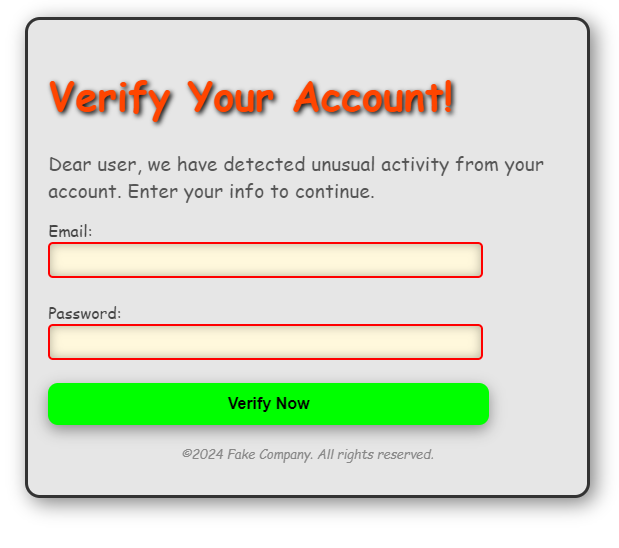

# Phishing Educator
EN:

A Phishing Simulator designed to simulate phishing scenarios for educational and professional use. This tool helps understand phishing attacks and trains individuals on identifying and mitigating such threats. It’s an ideal project for aspiring cybersecurity analysts.

## Table of Contents
- [Screenshots](#screenshots)
- [Introduction](#introduction)
- [Features](#features)
- [Technologies Used](#technologies-used)
- [Installation and Setup](#installation-and-setup)
- [Prerequisites](#prerequisites)
- [Usage](#usage)
- [Disclaimer](#disclaimer)
- [Acknowledgments](#acknowledgments)
- [License](#license)

## Screenshots
### Fake Template

## Introduction

Phishing is one of the most prevalent and effective cyberattack methods, targeting individuals and organizations by tricking them into revealing sensitive information, such as login credentials or financial details.

## Features

1. **Interactive dashboard with real-time phishing analytics**: Provides a centralized interface to manage simulations, view analytics, and access educational resources.
2. **Options to choose between realistic and fake phishing templates**: Enables users to choose between realistic and fake phishing templates for various training scenarios.
3. **Background Animations:**: Adds dynamic visuals for an engaging and modern user experience.
4. **Educational Resources**: Includes guides, tips, and real-world examples to improve phishing awareness and prevention strategies.

## Technologies Used

- **Frontend**: *HTML5*: Structuring the simulator's web pages with semantic elements for accessibility and responsiveness.
- *CSS3*: Styling the interface with modern design elements, including animations and visual effects.
- **Visual Enhancements**: *Blender*: Creating 3D animations for immersive and visually engaging backgrounds.
- **MP4 Video Backgrounds**: Adding dynamic moving visuals for an enhanced user interface.

## Usage
1) Navigate the Dashboard. Explore the main dashboard, which provides access to:
   Phishing templates (real and fake).
2) Educational resources.
3) Global phishing statistics.

## Disclaimer

The Phishing Simulator is a tool developed for educational purposes and professional training only. It is intended to raise awareness about phishing attacks, simulate real-world scenarios in a controlled environment, and promote best practices for cybersecurity.
## Use Responsibly
1) This tool must not be used for malicious purposes, including unauthorized phishing attacks or any activity that violates laws or ethical standards.
2) Users are responsible for ensuring compliance with all applicable laws and regulations when using this simulator.
The developers disclaim all liability for any misuse of this tool. By using this simulator, you agree to use it solely for lawful and ethical purposes.
If you are unsure about the legality or ethical implications of using this tool, seek guidance from a qualified cybersecurity professional or legal advisor.

## Acknowledgments

Special thanks to:
Marios Grivas (@Unf0undedOmn1s)
Ektoras E. Kalantzis (@Hektor754)

GR:
# Phishing Educator

Προσομοιωτής phishing που έχει σχεδιαστεί για την προσομοίωση σεναρίων για εκπαιδευτική και επαγγελματική χρήση. Αυτό το εργαλείο βοηθά στην κατανόηση των επιθέσεων phishing και εκπαιδεύει τα άτομα στον εντοπισμό και τον μετριασμό αυτών των απειλών. Είναι ένα ιδανικό έργο για επίδοξους αναλυτές κυβερνοασφάλειας.

## Table of Contents
- [Screenshots](#screenshots)
- [Introduction](#introduction)
- [Features](#features)
- [Technologies Used](#technologies-used)
- [Installation and Setup](#installation-and-setup)
- [Prerequisites](#prerequisites)
- [Usage](#usage)
- [Disclaimer](#disclaimer)
- [Acknowledgments](#acknowledgments)
- [License](#license)

## Screenshots
### Ψεύτικη Προσέγγιση

## Εισαγωγή

Το Phishing είναι μια από τις πιο διαδεδομένες και αποτελεσματικές μεθόδους κυβερνοεπιθέσεων, η οποία στοχεύει σε άτομα και οργανισμούς εξαπατώντας τους να αποκαλύψουν ευαίσθητες πληροφορίες, όπως στοιχεία σύνδεσης ή οικονομικά στοιχεία.

## Χαρακτηριστικά

1. **Επιλογές επιλογής μεταξύ ρεαλιστικών και ψεύτικων προτύπων phishing**: Επιτρέπει στους χρήστες να επιλέγουν μεταξύ ρεαλιστικών και ψεύτικων προτύπων phishing για διάφορα εκπαιδευτικά σενάρια.
2. **Κινούμενο σχέδια στο φόντο:**: Προσθέτει δυναμικά οπτικά στοιχεία για μια ελκυστική και σύγχρονη εμπειρία χρήστη.
3. **Εκπαιδευτικοί πόροι**: Περιλαμβάνει οδηγούς, συμβουλές και παραδείγματα από τον πραγματικό κόσμο για τη βελτίωση της ευαισθητοποίησης και των στρατηγικών πρόληψης του phishing.

## Χρησιμοποιούμενες τεχνολογίες

- **Frontend**: *HTML5*: Διάρθρωση των ιστοσελίδων του προσομοιωτή με σημασιολογικά στοιχεία για προσβασιμότητα και ανταπόκριση.
- *CSS3*: Διαμόρφωση της διεπαφής με σύγχρονα στοιχεία σχεδιασμού, συμπεριλαμβανομένων κινούμενων σχεδίων και οπτικών εφέ.
- **Οπτικές βελτιώσεις**: *Blender*: Δημιουργία τρισδιάστατων κινούμενων σχεδίων για καθηλωτικά και οπτικά ελκυστικά φόντα.
- **Φόντo-Bίντεο MP4**: Προσθήκη δυναμικών κινούμενων οπτικών στοιχείων για μια βελτιωμένη διεπαφή χρήστη.

## Χρήση

1) Πλοηγηθείτε στον πίνακα οργάνων. Εξερευνήστε το κύριο ταμπλό, το οποίο παρέχει πρόσβαση σε:
   Πρότυπα phishing (πραγματικά και ψεύτικα).
2) Εκπαιδευτικοί πόροι.

## Αποποίηση ευθύνης

Το Phishing Educator, είναι ένα εργαλείο που αναπτύχθηκε για εκπαιδευτικούς σκοπούς και επαγγελματική κατάρτιση μόνο. Σκοπός του είναι η ευαισθητοποίηση σχετικά με τις επιθέσεις phishing, η προσομοίωση πραγματικών σεναρίων σε ελεγχόμενο περιβάλλον και η προώθηση βέλτιστων πρακτικών για την ασφάλεια στον κυβερνοχώρο.

## Χρήση με υπευθυνότητα

1) Αυτό το εργαλείο δεν πρέπει να χρησιμοποιείται για κακόβουλους σκοπούς, συμπεριλαμβανομένων των μη εξουσιοδοτημένων επιθέσεων phishing ή οποιασδήποτε δραστηριότητας που παραβιάζει τους νόμους ή τα πρότυπα δεοντολογίας.
2) Οι χρήστες είναι υπεύθυνοι για τη διασφάλιση της συμμόρφωσης με όλους τους ισχύοντες νόμους και κανονισμούς κατά τη χρήση αυτού του προσομοιωτή.
Οι προγραμματιστές αποποιούνται κάθε ευθύνη για οποιαδήποτε κακή χρήση αυτού του εργαλείου. Χρησιμοποιώντας αυτόν τον προσομοιωτή, συμφωνείτε να τον χρησιμοποιείτε αποκλειστικά για νόμιμους και ηθικούς σκοπούς.
Εάν δεν είστε σίγουροι για τη νομιμότητα ή τις ηθικές επιπτώσεις της χρήσης αυτού του εργαλείου, ζητήστε καθοδήγηση από έναν εξειδικευμένο επαγγελματία στον τομέα της ασφάλειας στον κυβερνοχώρο ή νομικό σύμβουλο.

## Ευχαριστία

Ιδιαίτερα ευχαριστία στους:
Marios Grivas (@Unf0undedOmn1s)
Ektoras E. Kalantzis (@Hektor754)

## License
© 2024 Marios Grivas, Ektoras E. Kalantzis. All rights reserved.
